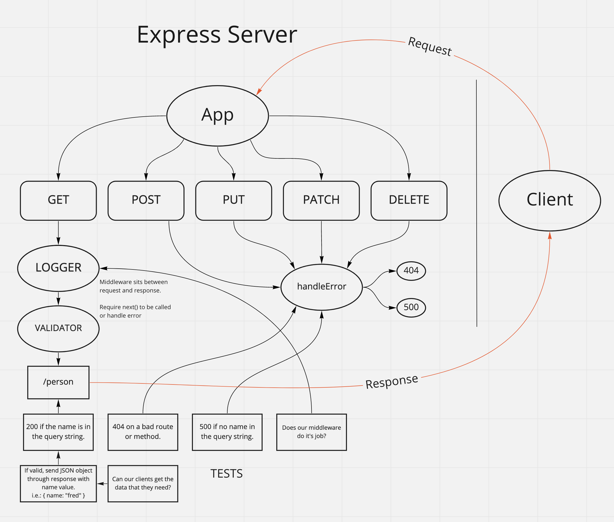

# Basic Express Server

Created by Ryan Emmans

## Installation

None currently.

## Summary of Problem Domain

From a business requirements standpoint, we will be building a basic Express server using best practices, including server modularization, use of middleware, and tests.

## Links to application deployment

- [Heroku Main Branch](https://ryanemmans-basic-express.herokuapp.com/)
- [GitHub Actions](https://github.com/ryanemmans/basic-express-server/actions)
- [Pull Requests](https://github.com/ryanemmans/basic-express-server/pulls?q=is%3Apr+is%3Aclosed)

## Include embedded UML

## Routes

- Method: GET
  - Path: `/person`
    - Expects a query string from the user with a “name” property
    - When present, output JSON to the client with this shape: `{ name: "name provided" }`
    - Without a name in the query string, force a “500” error

## Notes
